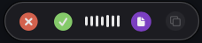

# TypeLessBuddy

[](LICENSE)
[](https://github.com/subjectCarterSoftware/typelessbuddy/actions/workflows/ci.yml)
[](https://github.com/subjectCarterSoftware/typelessbuddy/releases/latest)
[](#requirements)

Local-first voice writing with a built-in buddy for macOS.

TypeLessBuddy turns speech into text anywhere on your Mac. Use it as plain dictation when you want a raw transcript, or say "buddy" to route the transcript through the built-in assistant for cleanup and rewriting.

<p align="center">
  <a href="https://github.com/subjectCarterSoftware/typelessbuddy/releases/latest/download/TypeLessBuddy.dmg">
    
  </a>
</p>

<p align="center">
  
</p>

## Features

- Local Whisper models for transcription
- Local LLMs for assistant actions
- Context pass-through from copied text, selected text, and the last transcript
- Local history tracking
- Note saving
- Custom vocabulary packs
- Word replacements
- Preferred microphone selection

## Install

1. Download `TypeLessBuddy.dmg` from the [latest release](https://github.com/subjectCarterSoftware/typelessbuddy/releases/latest).
2. Open the disk image.
3. Drag `TypeLessBuddy.app` into `Applications`.
4. Launch TypeLessBuddy from `Applications`.

macOS will ask for Microphone permission on first use. Enable Accessibility permission if you want TypeLessBuddy to auto-paste into other apps.

## Usage

Use your shortcut, speak, and release. TypeLessBuddy transcribes locally and sends the result to your clipboard or active app.

Say "buddy" anywhere in the message when you want the assistant to rewrite or refine the transcript before output.

## Privacy

- Audio is captured only while you are recording.
- Transcription runs locally on your Mac.
- Cloud requests are never made unless you enable a cloud rewrite provider.
- Cloud API keys are stored in the macOS Keychain.

See [PRIVACY.md](PRIVACY.md) for details.

## Requirements

- macOS 14 or later
- Microphone permission
- Accessibility permission for auto-paste

## Build From Source

Build the debug app:

```bash
./scripts/build-app.sh
```

Build the local DMG installer:

```bash
./scripts/build-dmg.sh
```

The DMG is written to `dist/TypeLessBuddy.dmg`. Release packaging and notarization notes are in [docs/RELEASING.md](docs/RELEASING.md).

## Contributing

See [CONTRIBUTING.md](CONTRIBUTING.md) for setup, signing, build, and test guidance.

## License

[MIT](LICENSE)
