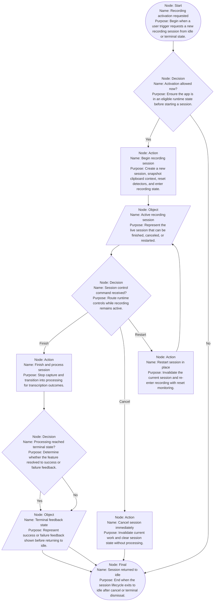

# Recording Session Lifecycle

```mermaid
flowchart TD
  S1(["Node: Start<br/>Name: Recording activation requested<br/>Purpose: Begin when a user trigger requests a new recording session from idle or terminal state."])
  D1{"Node: Decision<br/>Name: Activation allowed now?<br/>Purpose: Ensure the app is in an eligible runtime state before starting a session."}
  A1["Node: Action<br/>Name: Begin recording session<br/>Purpose: Create a new session, snapshot clipboard context, reset detectors, and enter recording state."]
  O1[/"Node: Object<br/>Name: Active recording session<br/>Purpose: Represent the live session that can be finished, canceled, or restarted."/]
  D2{"Node: Decision<br/>Name: Session control command received?<br/>Purpose: Route runtime controls while recording remains active."}
  A2["Node: Action<br/>Name: Finish and process session<br/>Purpose: Stop capture and transition into processing for transcription outcomes."]
  D3{"Node: Decision<br/>Name: Processing reached terminal state?<br/>Purpose: Determine whether the feature resolved to success or failure feedback."}
  O2[/"Node: Object<br/>Name: Terminal feedback state<br/>Purpose: Represent success or failure feedback shown before returning to idle."/]
  A3["Node: Action<br/>Name: Cancel session immediately<br/>Purpose: Invalidate current work and clear session state without processing." ]
  A4["Node: Action<br/>Name: Restart session in place<br/>Purpose: Invalidate the current session and re-enter recording with reset monitoring." ]
  F1(["Node: Final<br/>Name: Session returned to idle<br/>Purpose: End when the session lifecycle exits to idle after cancel or terminal dismissal."])

  S1 --> D1
  D1 -->|Yes| A1 --> O1 --> D2
  D1 -->|No| F1
  D2 -->|Finish| A2 --> D3
  D3 -->|Yes| O2 --> F1
  D3 -->|No| O2 --> F1
  D2 -->|Cancel| A3 --> F1
  D2 -->|Restart| A4 --> O1
```
