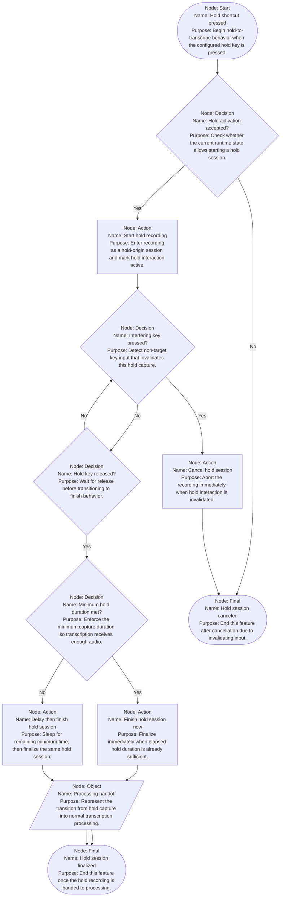

# Hold-to-Transcribe Interaction

```mermaid
flowchart TD
  S1(["Node: Start<br/>Name: Hold shortcut pressed<br/>Purpose: Begin hold-to-transcribe behavior when the configured hold key is pressed."])
  D1{"Node: Decision<br/>Name: Hold activation accepted?<br/>Purpose: Check whether the current runtime state allows starting a hold session."}
  A1["Node: Action<br/>Name: Start hold recording<br/>Purpose: Enter recording as a hold-origin session and mark hold interaction active."]
  D2{"Node: Decision<br/>Name: Interfering key pressed?<br/>Purpose: Detect non-target key input that invalidates this hold capture."}
  A2["Node: Action<br/>Name: Cancel hold session<br/>Purpose: Abort the recording immediately when hold interaction is invalidated." ]
  D3{"Node: Decision<br/>Name: Hold key released?<br/>Purpose: Wait for release before transitioning to finish behavior."}
  D4{"Node: Decision<br/>Name: Minimum hold duration met?<br/>Purpose: Enforce the minimum capture duration so transcription receives enough audio."}
  A3["Node: Action<br/>Name: Finish hold session now<br/>Purpose: Finalize immediately when elapsed hold duration is already sufficient." ]
  A4["Node: Action<br/>Name: Delay then finish hold session<br/>Purpose: Sleep for remaining minimum time, then finalize the same hold session." ]
  O1[/"Node: Object<br/>Name: Processing handoff<br/>Purpose: Represent the transition from hold capture into normal transcription processing."/]
  F1(["Node: Final<br/>Name: Hold session canceled<br/>Purpose: End this feature after cancellation due to invalidating input." ])
  F2(["Node: Final<br/>Name: Hold session finalized<br/>Purpose: End this feature once the hold recording is handed to processing." ])

  S1 --> D1
  D1 -->|Yes| A1 --> D2
  D1 -->|No| F1
  D2 -->|Yes| A2 --> F1
  D2 -->|No| D3
  D3 -->|No| D2
  D3 -->|Yes| D4
  D4 -->|Yes| A3 --> O1 --> F2
  D4 -->|No| A4 --> O1 --> F2
```
