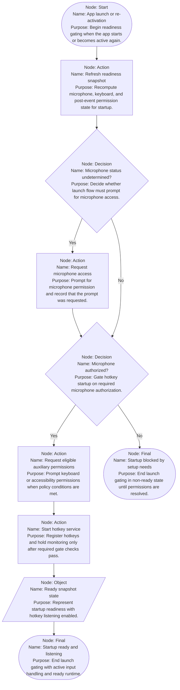

# Permission-Gated Startup Readiness

```mermaid
flowchart TD
  S1(["Node: Start<br/>Name: App launch or re-activation<br/>Purpose: Begin readiness gating when the app starts or becomes active again."])
  A1["Node: Action<br/>Name: Refresh readiness snapshot<br/>Purpose: Recompute microphone, keyboard, and post-event permission state for startup."]
  D1{"Node: Decision<br/>Name: Microphone status undetermined?<br/>Purpose: Decide whether launch flow must prompt for microphone access."}
  A2["Node: Action<br/>Name: Request microphone access<br/>Purpose: Prompt for microphone permission and record that the prompt was requested." ]
  D2{"Node: Decision<br/>Name: Microphone authorized?<br/>Purpose: Gate hotkey startup on required microphone authorization."}
  A3["Node: Action<br/>Name: Request eligible auxiliary permissions<br/>Purpose: Prompt keyboard or accessibility permissions when policy conditions are met." ]
  A4["Node: Action<br/>Name: Start hotkey service<br/>Purpose: Register hotkeys and hold monitoring only after required gate checks pass." ]
  O1[/"Node: Object<br/>Name: Ready snapshot state<br/>Purpose: Represent startup readiness with hotkey listening enabled."/]
  F1(["Node: Final<br/>Name: Startup blocked by setup needs<br/>Purpose: End launch gating in non-ready state until permissions are resolved." ])
  F2(["Node: Final<br/>Name: Startup ready and listening<br/>Purpose: End launch gating with active input handling and ready runtime." ])

  S1 --> A1 --> D1
  D1 -->|Yes| A2 --> D2
  D1 -->|No| D2
  D2 -->|Yes| A3 --> A4 --> O1 --> F2
  D2 -->|No| F1
```
