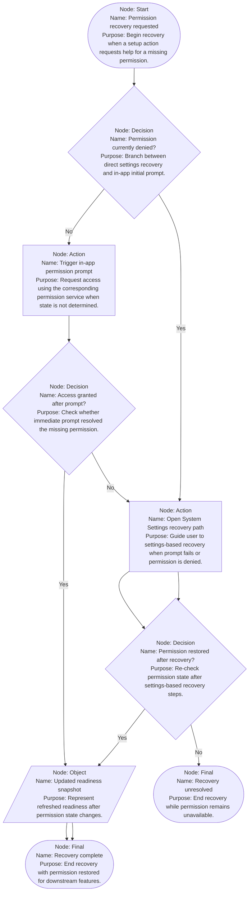

# Permission Recovery Flow

```mermaid
flowchart TD
  S1(["Node: Start<br/>Name: Permission recovery requested<br/>Purpose: Begin recovery when a setup action requests help for a missing permission." ])
  D1{"Node: Decision<br/>Name: Permission currently denied?<br/>Purpose: Branch between direct settings recovery and in-app initial prompt."}
  A1["Node: Action<br/>Name: Trigger in-app permission prompt<br/>Purpose: Request access using the corresponding permission service when state is not determined." ]
  D2{"Node: Decision<br/>Name: Access granted after prompt?<br/>Purpose: Check whether immediate prompt resolved the missing permission."}
  A2["Node: Action<br/>Name: Open System Settings recovery path<br/>Purpose: Guide user to settings-based recovery when prompt fails or permission is denied." ]
  D3{"Node: Decision<br/>Name: Permission restored after recovery?<br/>Purpose: Re-check permission state after settings-based recovery steps."}
  O1[/"Node: Object<br/>Name: Updated readiness snapshot<br/>Purpose: Represent refreshed readiness after permission state changes."/]
  F1(["Node: Final<br/>Name: Recovery unresolved<br/>Purpose: End recovery while permission remains unavailable." ])
  F2(["Node: Final<br/>Name: Recovery complete<br/>Purpose: End recovery with permission restored for downstream features." ])

  S1 --> D1
  D1 -->|No| A1 --> D2
  D1 -->|Yes| A2 --> D3
  D2 -->|Yes| O1 --> F2
  D2 -->|No| A2 --> D3
  D3 -->|Yes| O1 --> F2
  D3 -->|No| F1
```
