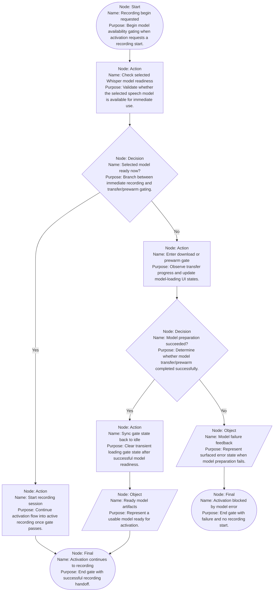

# Whisper Model Availability Gate

```mermaid
flowchart TD
  S1(["Node: Start<br/>Name: Recording begin requested<br/>Purpose: Begin model availability gating when activation requests a recording start." ])
  A1["Node: Action<br/>Name: Check selected Whisper model readiness<br/>Purpose: Validate whether the selected speech model is available for immediate use." ]
  D1{"Node: Decision<br/>Name: Selected model ready now?<br/>Purpose: Branch between immediate recording and transfer/prewarm gating."}
  A2["Node: Action<br/>Name: Enter download or prewarm gate<br/>Purpose: Observe transfer progress and update model-loading UI states." ]
  D2{"Node: Decision<br/>Name: Model preparation succeeded?<br/>Purpose: Determine whether model transfer/prewarm completed successfully."}
  A3["Node: Action<br/>Name: Sync gate state back to idle<br/>Purpose: Clear transient loading gate state after successful model readiness." ]
  O1[/"Node: Object<br/>Name: Ready model artifacts<br/>Purpose: Represent a usable model ready for activation."/]
  A4["Node: Action<br/>Name: Start recording session<br/>Purpose: Continue activation flow into active recording once gate passes." ]
  O2[/"Node: Object<br/>Name: Model failure feedback<br/>Purpose: Represent surfaced error state when model preparation fails."/]
  F1(["Node: Final<br/>Name: Activation continues to recording<br/>Purpose: End gate with successful recording handoff." ])
  F2(["Node: Final<br/>Name: Activation blocked by model error<br/>Purpose: End gate with failure and no recording start." ])

  S1 --> A1 --> D1
  D1 -->|Yes| A4 --> F1
  D1 -->|No| A2 --> D2
  D2 -->|Yes| A3 --> O1 --> F1
  D2 -->|No| O2 --> F2
```
