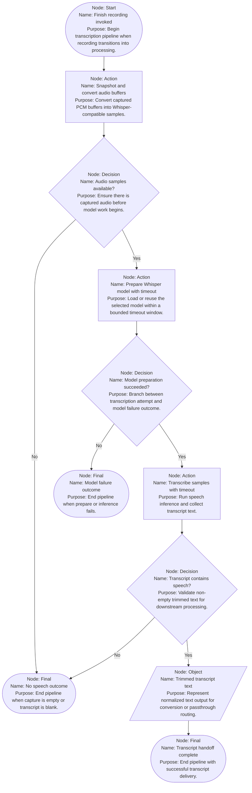

# Speech-to-Text Transcription Pipeline

```mermaid
flowchart TD
  S1(["Node: Start<br/>Name: Finish recording invoked<br/>Purpose: Begin transcription pipeline when recording transitions into processing." ])
  A1["Node: Action<br/>Name: Snapshot and convert audio buffers<br/>Purpose: Convert captured PCM buffers into Whisper-compatible samples." ]
  D1{"Node: Decision<br/>Name: Audio samples available?<br/>Purpose: Ensure there is captured audio before model work begins."}
  A2["Node: Action<br/>Name: Prepare Whisper model with timeout<br/>Purpose: Load or reuse the selected model within a bounded timeout window." ]
  D2{"Node: Decision<br/>Name: Model preparation succeeded?<br/>Purpose: Branch between transcription attempt and model failure outcome."}
  A3["Node: Action<br/>Name: Transcribe samples with timeout<br/>Purpose: Run speech inference and collect transcript text." ]
  D3{"Node: Decision<br/>Name: Transcript contains speech?<br/>Purpose: Validate non-empty trimmed text for downstream processing."}
  O1[/"Node: Object<br/>Name: Trimmed transcript text<br/>Purpose: Represent normalized text output for conversion or passthrough routing."/]
  F1(["Node: Final<br/>Name: No speech outcome<br/>Purpose: End pipeline when capture is empty or transcript is blank." ])
  F2(["Node: Final<br/>Name: Model failure outcome<br/>Purpose: End pipeline when prepare or inference fails." ])
  F3(["Node: Final<br/>Name: Transcript handoff complete<br/>Purpose: End pipeline with successful transcript delivery." ])

  S1 --> A1 --> D1
  D1 -->|No| F1
  D1 -->|Yes| A2 --> D2
  D2 -->|No| F2
  D2 -->|Yes| A3 --> D3
  D3 -->|No| F1
  D3 -->|Yes| O1 --> F3
```
