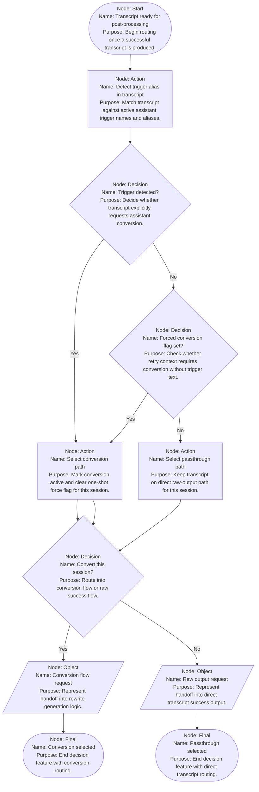

# Assistant Trigger Conversion Decision

```mermaid
flowchart TD
  S1(["Node: Start<br/>Name: Transcript ready for post-processing<br/>Purpose: Begin routing once a successful transcript is produced." ])
  A1["Node: Action<br/>Name: Detect trigger alias in transcript<br/>Purpose: Match transcript against active assistant trigger names and aliases." ]
  D1{"Node: Decision<br/>Name: Trigger detected?<br/>Purpose: Decide whether transcript explicitly requests assistant conversion."}
  D2{"Node: Decision<br/>Name: Forced conversion flag set?<br/>Purpose: Check whether retry context requires conversion without trigger text."}
  A2["Node: Action<br/>Name: Select conversion path<br/>Purpose: Mark conversion active and clear one-shot force flag for this session." ]
  A3["Node: Action<br/>Name: Select passthrough path<br/>Purpose: Keep transcript on direct raw-output path for this session." ]
  D3{"Node: Decision<br/>Name: Convert this session?<br/>Purpose: Route into conversion flow or raw success flow."}
  O1[/"Node: Object<br/>Name: Conversion flow request<br/>Purpose: Represent handoff into rewrite generation logic."/]
  O2[/"Node: Object<br/>Name: Raw output request<br/>Purpose: Represent handoff into direct transcript success output."/]
  F1(["Node: Final<br/>Name: Conversion selected<br/>Purpose: End decision feature with conversion routing." ])
  F2(["Node: Final<br/>Name: Passthrough selected<br/>Purpose: End decision feature with direct transcript routing." ])

  S1 --> A1 --> D1
  D1 -->|Yes| A2 --> D3
  D1 -->|No| D2
  D2 -->|Yes| A2 --> D3
  D2 -->|No| A3 --> D3
  D3 -->|Yes| O1 --> F1
  D3 -->|No| O2 --> F2
```
