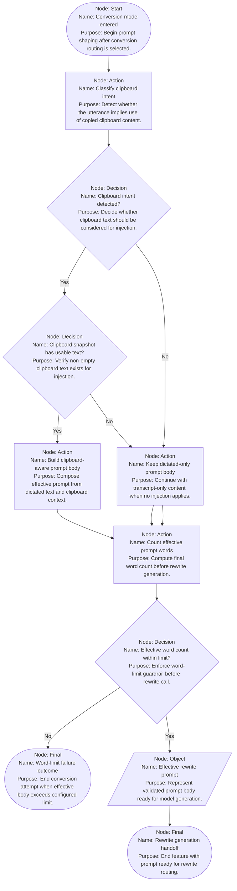

# Clipboard-Aware Prompt Injection

```mermaid
flowchart TD
  S1(["Node: Start<br/>Name: Conversion mode entered<br/>Purpose: Begin prompt shaping after conversion routing is selected." ])
  A1["Node: Action<br/>Name: Classify clipboard intent<br/>Purpose: Detect whether the utterance implies use of copied clipboard content." ]
  D1{"Node: Decision<br/>Name: Clipboard intent detected?<br/>Purpose: Decide whether clipboard text should be considered for injection."}
  D2{"Node: Decision<br/>Name: Clipboard snapshot has usable text?<br/>Purpose: Verify non-empty clipboard text exists for injection."}
  A2["Node: Action<br/>Name: Build clipboard-aware prompt body<br/>Purpose: Compose effective prompt from dictated text and clipboard context." ]
  A3["Node: Action<br/>Name: Keep dictated-only prompt body<br/>Purpose: Continue with transcript-only content when no injection applies." ]
  A4["Node: Action<br/>Name: Count effective prompt words<br/>Purpose: Compute final word count before rewrite generation." ]
  D3{"Node: Decision<br/>Name: Effective word count within limit?<br/>Purpose: Enforce word-limit guardrail before rewrite call."}
  O1[/"Node: Object<br/>Name: Effective rewrite prompt<br/>Purpose: Represent validated prompt body ready for model generation."/]
  F1(["Node: Final<br/>Name: Word-limit failure outcome<br/>Purpose: End conversion attempt when effective body exceeds configured limit." ])
  F2(["Node: Final<br/>Name: Rewrite generation handoff<br/>Purpose: End feature with prompt ready for rewrite routing." ])

  S1 --> A1 --> D1
  D1 -->|Yes| D2
  D1 -->|No| A3 --> A4
  D2 -->|Yes| A2 --> A4
  D2 -->|No| A3 --> A4
  A4 --> D3
  D3 -->|No| F1
  D3 -->|Yes| O1 --> F2
```
