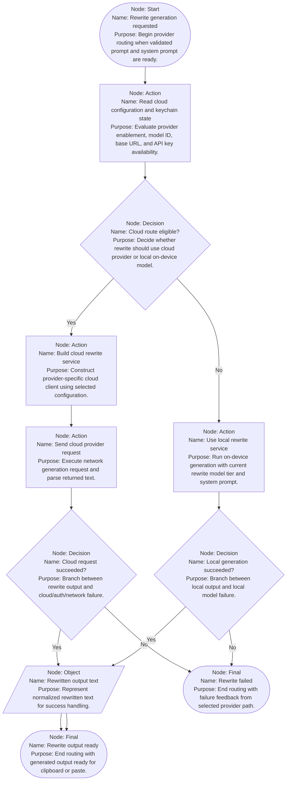

# Cloud-vs-Local Rewrite Routing

```mermaid
flowchart TD
  S1(["Node: Start<br/>Name: Rewrite generation requested<br/>Purpose: Begin provider routing when validated prompt and system prompt are ready." ])
  A1["Node: Action<br/>Name: Read cloud configuration and keychain state<br/>Purpose: Evaluate provider enablement, model ID, base URL, and API key availability." ]
  D1{"Node: Decision<br/>Name: Cloud route eligible?<br/>Purpose: Decide whether rewrite should use cloud provider or local on-device model."}
  A2["Node: Action<br/>Name: Build cloud rewrite service<br/>Purpose: Construct provider-specific cloud client using selected configuration." ]
  A3["Node: Action<br/>Name: Send cloud provider request<br/>Purpose: Execute network generation request and parse returned text." ]
  D2{"Node: Decision<br/>Name: Cloud request succeeded?<br/>Purpose: Branch between rewrite output and cloud/auth/network failure."}
  A4["Node: Action<br/>Name: Use local rewrite service<br/>Purpose: Run on-device generation with current rewrite model tier and system prompt." ]
  D3{"Node: Decision<br/>Name: Local generation succeeded?<br/>Purpose: Branch between local output and local model failure."}
  O1[/"Node: Object<br/>Name: Rewritten output text<br/>Purpose: Represent normalized rewritten text for success handling."/]
  F1(["Node: Final<br/>Name: Rewrite failed<br/>Purpose: End routing with failure feedback from selected provider path." ])
  F2(["Node: Final<br/>Name: Rewrite output ready<br/>Purpose: End routing with generated output ready for clipboard or paste." ])

  S1 --> A1 --> D1
  D1 -->|Yes| A2 --> A3 --> D2
  D2 -->|Yes| O1 --> F2
  D2 -->|No| F1
  D1 -->|No| A4 --> D3
  D3 -->|Yes| O1 --> F2
  D3 -->|No| F1
```
