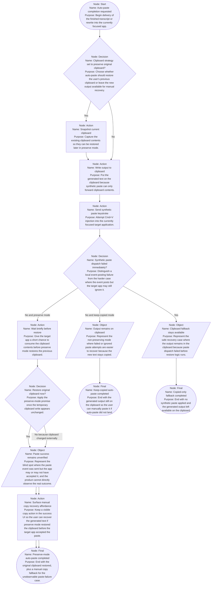

# Protected Auto-Paste with Clipboard Restore

Assumptions:
- Assumed the product cannot reliably detect whether the target application actually accepted the paste after the synthetic `Cmd+V` event posts, because the current implementation only knows whether the event dispatch itself failed.
- Assumed the success-state copy control should be explicitly marked as the recovery path only when auto-paste is enabled, because that is when preserve mode can remove the generated text from the clipboard before the user verifies the paste landed.
