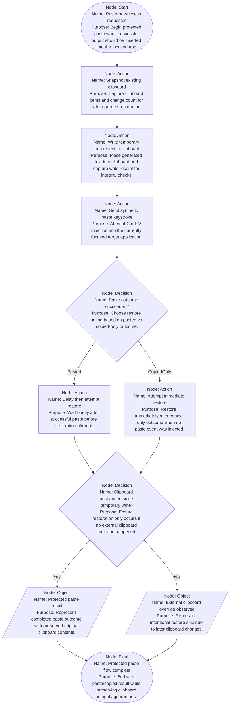

# Protected Auto-Paste with Clipboard Restore

```mermaid
flowchart TD
  S1(["Node: Start<br/>Name: Paste-on-success requested<br/>Purpose: Begin protected paste when successful output should be inserted into the focused app." ])
  A1["Node: Action<br/>Name: Snapshot existing clipboard<br/>Purpose: Capture clipboard items and change count for later guarded restoration." ]
  A2["Node: Action<br/>Name: Write temporary output text to clipboard<br/>Purpose: Place generated text into clipboard and capture write receipt for integrity checks." ]
  A3["Node: Action<br/>Name: Send synthetic paste keystroke<br/>Purpose: Attempt Cmd+V injection into the currently focused target application." ]
  D1{"Node: Decision<br/>Name: Paste outcome succeeded?<br/>Purpose: Choose restore timing based on pasted vs copied-only outcome."}
  A4["Node: Action<br/>Name: Delay then attempt restore<br/>Purpose: Wait briefly after successful paste before restoration attempt." ]
  A5["Node: Action<br/>Name: Attempt immediate restore<br/>Purpose: Restore immediately after copied-only outcome when no paste event was injected." ]
  D2{"Node: Decision<br/>Name: Clipboard unchanged since temporary write?<br/>Purpose: Ensure restoration only occurs if no external clipboard mutation happened."}
  O1[/"Node: Object<br/>Name: Protected paste result<br/>Purpose: Represent completed paste outcome with preserved original clipboard contents."/]
  O2[/"Node: Object<br/>Name: External clipboard override observed<br/>Purpose: Represent intentional restore skip due to later clipboard changes."/]
  F1(["Node: Final<br/>Name: Protected paste flow complete<br/>Purpose: End with paste/copied result while preserving clipboard integrity guarantees." ])

  S1 --> A1 --> A2 --> A3 --> D1
  D1 -->|Pasted| A4 --> D2
  D1 -->|CopiedOnly| A5 --> D2
  D2 -->|Yes| O1 --> F1
  D2 -->|No| O2 --> F1
```
