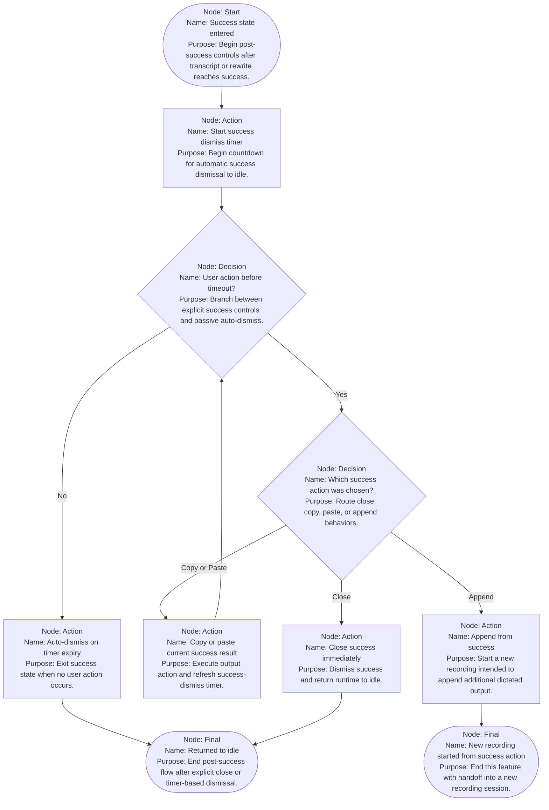

# Success-State Post Actions

```mermaid
flowchart TD
  S1(["Node: Start<br/>Name: Success state entered<br/>Purpose: Begin post-success controls after transcript or rewrite reaches success." ])
  A1["Node: Action<br/>Name: Start success dismiss timer<br/>Purpose: Begin countdown for automatic success dismissal to idle." ]
  D1{"Node: Decision<br/>Name: User action before timeout?<br/>Purpose: Branch between explicit success controls and passive auto-dismiss."}
  D2{"Node: Decision<br/>Name: Which success action was chosen?<br/>Purpose: Route close, copy, paste, or append behaviors."}
  A2["Node: Action<br/>Name: Close success immediately<br/>Purpose: Dismiss success and return runtime to idle." ]
  A3["Node: Action<br/>Name: Copy or paste current success result<br/>Purpose: Execute output action and refresh success-dismiss timer." ]
  A4["Node: Action<br/>Name: Append from success<br/>Purpose: Start a new recording intended to append additional dictated output." ]
  A6["Node: Action<br/>Name: Auto-dismiss on timer expiry<br/>Purpose: Exit success state when no user action occurs." ]
  F1(["Node: Final<br/>Name: Returned to idle<br/>Purpose: End post-success flow after explicit close or timer-based dismissal." ])
  F2(["Node: Final<br/>Name: New recording started from success action<br/>Purpose: End this feature with handoff into a new recording session." ])

  S1 --> A1 --> D1
  D1 -->|No| A6 --> F1
  D1 -->|Yes| D2
  D2 -->|Close| A2 --> F1
  D2 -->|Copy or Paste| A3 --> D1
  D2 -->|Append| A4 --> F2
```
