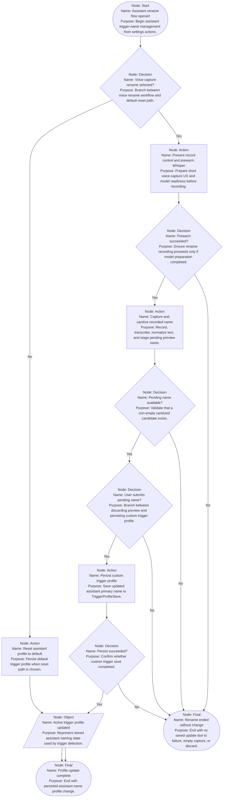

# Assistant Name Voice-Rename Flow

```mermaid
flowchart TD
  S1(["Node: Start<br/>Name: Assistant rename flow opened<br/>Purpose: Begin assistant trigger-name management from settings actions." ])
  D1{"Node: Decision<br/>Name: Voice capture rename selected?<br/>Purpose: Branch between voice rename workflow and default reset path."}
  A1["Node: Action<br/>Name: Present record control and prewarm Whisper<br/>Purpose: Prepare short voice-capture UX and model readiness before recording." ]
  D2{"Node: Decision<br/>Name: Prewarm succeeded?<br/>Purpose: Ensure rename recording proceeds only if model preparation completed."}
  A2["Node: Action<br/>Name: Capture and sanitize recorded name<br/>Purpose: Record, transcribe, normalize text, and stage pending preview name." ]
  D3{"Node: Decision<br/>Name: Pending name available?<br/>Purpose: Validate that a non-empty sanitized candidate exists."}
  D4{"Node: Decision<br/>Name: User submits pending name?<br/>Purpose: Branch between discarding preview and persisting custom trigger profile."}
  A3["Node: Action<br/>Name: Persist custom trigger profile<br/>Purpose: Save updated assistant primary name to TriggerProfileStore." ]
  D5{"Node: Decision<br/>Name: Persist succeeded?<br/>Purpose: Confirm whether custom trigger save completed."}
  A4["Node: Action<br/>Name: Reset assistant profile to default<br/>Purpose: Persist default trigger profile when reset path is chosen." ]
  O1[/"Node: Object<br/>Name: Active trigger profile updated<br/>Purpose: Represent stored assistant naming state used by trigger detection."/]
  F1(["Node: Final<br/>Name: Rename ended without change<br/>Purpose: End with no saved update due to failure, empty capture, or discard." ])
  F2(["Node: Final<br/>Name: Profile update complete<br/>Purpose: End with persisted assistant-name profile change." ])

  S1 --> D1
  D1 -->|Yes| A1 --> D2
  D2 -->|No| F1
  D2 -->|Yes| A2 --> D3
  D3 -->|No| F1
  D3 -->|Yes| D4
  D4 -->|No| F1
  D4 -->|Yes| A3 --> D5
  D5 -->|Yes| O1 --> F2
  D5 -->|No| F1
  D1 -->|No| A4 --> O1 --> F2
```
