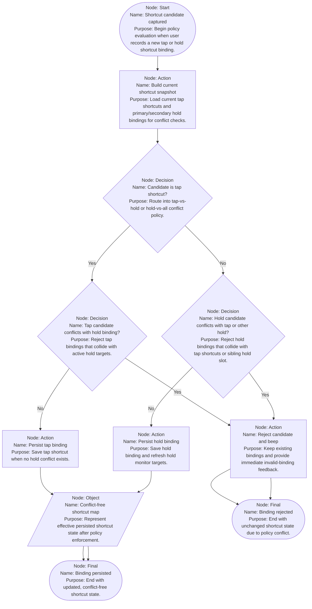

# Shortcut Conflict Prevention

```mermaid
flowchart TD
  S1(["Node: Start<br/>Name: Shortcut candidate captured<br/>Purpose: Begin policy evaluation when user records a new tap or hold shortcut binding." ])
  A1["Node: Action<br/>Name: Build current shortcut snapshot<br/>Purpose: Load current tap shortcuts and primary/secondary hold bindings for conflict checks." ]
  D1{"Node: Decision<br/>Name: Candidate is tap shortcut?<br/>Purpose: Route into tap-vs-hold or hold-vs-all conflict policy."}
  D2{"Node: Decision<br/>Name: Tap candidate conflicts with hold binding?<br/>Purpose: Reject tap bindings that collide with active hold targets."}
  A2["Node: Action<br/>Name: Persist tap binding<br/>Purpose: Save tap shortcut when no hold conflict exists." ]
  D3{"Node: Decision<br/>Name: Hold candidate conflicts with tap or other hold?<br/>Purpose: Reject hold bindings that collide with tap shortcuts or sibling hold slot."}
  A3["Node: Action<br/>Name: Persist hold binding<br/>Purpose: Save hold binding and refresh hold monitor targets." ]
  A4["Node: Action<br/>Name: Reject candidate and beep<br/>Purpose: Keep existing bindings and provide immediate invalid-binding feedback." ]
  O1[/"Node: Object<br/>Name: Conflict-free shortcut map<br/>Purpose: Represent effective persisted shortcut state after policy enforcement."/]
  F1(["Node: Final<br/>Name: Binding rejected<br/>Purpose: End with unchanged shortcut state due to policy conflict." ])
  F2(["Node: Final<br/>Name: Binding persisted<br/>Purpose: End with updated, conflict-free shortcut state." ])

  S1 --> A1 --> D1
  D1 -->|Yes| D2
  D2 -->|Yes| A4 --> F1
  D2 -->|No| A2 --> O1 --> F2
  D1 -->|No| D3
  D3 -->|Yes| A4 --> F1
  D3 -->|No| A3 --> O1 --> F2
```
