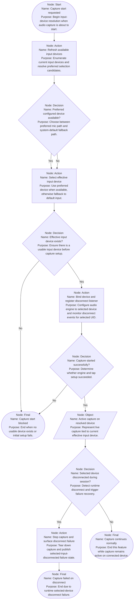

# Microphone Selection and Disconnect Handling

```mermaid
flowchart TD
  S1(["Node: Start<br/>Name: Capture start requested<br/>Purpose: Begin input-device resolution when audio capture is about to start." ])
  A1["Node: Action<br/>Name: Refresh available input devices<br/>Purpose: Enumerate current input devices and resolve preferred selection candidates." ]
  D1{"Node: Decision<br/>Name: Preferred configured device available?<br/>Purpose: Choose between preferred mic path and system-default fallback path."}
  A2["Node: Action<br/>Name: Select effective input device<br/>Purpose: Use preferred device when available, otherwise fallback to default input." ]
  D2{"Node: Decision<br/>Name: Effective input device exists?<br/>Purpose: Ensure there is a usable input device before capture setup."}
  A3["Node: Action<br/>Name: Bind device and register disconnect listener<br/>Purpose: Configure audio engine to selected device and monitor disconnect events for selected UID." ]
  D3{"Node: Decision<br/>Name: Capture started successfully?<br/>Purpose: Determine whether engine and tap setup succeeded."}
  D4{"Node: Decision<br/>Name: Selected device disconnected during session?<br/>Purpose: Detect runtime disconnect and trigger failure recovery."}
  A4["Node: Action<br/>Name: Stop capture and surface disconnect failure<br/>Purpose: Tear down capture and publish selected-input-disconnected failure state." ]
  O1[/"Node: Object<br/>Name: Active capture on resolved device<br/>Purpose: Represent live capture tied to current effective input device."/]
  F1(["Node: Final<br/>Name: Capture start blocked<br/>Purpose: End when no usable device exists or initial setup fails." ])
  F2(["Node: Final<br/>Name: Capture failed on disconnect<br/>Purpose: End due to runtime selected-device disconnect failure." ])
  F3(["Node: Final<br/>Name: Capture continues normally<br/>Purpose: End this feature while capture remains active on connected device." ])

  S1 --> A1 --> D1
  D1 -->|Yes| A2
  D1 -->|No| A2
  A2 --> D2
  D2 -->|No| F1
  D2 -->|Yes| A3 --> D3
  D3 -->|No| F1
  D3 -->|Yes| O1 --> D4
  D4 -->|Yes| A4 --> F2
  D4 -->|No| F3
```
