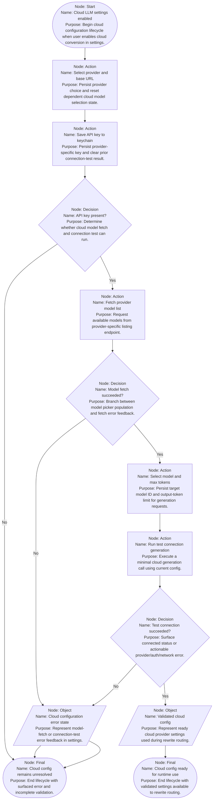

# Cloud LLM Configuration Lifecycle

```mermaid
flowchart TD
  S1(["Node: Start<br/>Name: Cloud LLM settings enabled<br/>Purpose: Begin cloud configuration lifecycle when user enables cloud conversion in settings." ])
  A1["Node: Action<br/>Name: Select provider and base URL<br/>Purpose: Persist provider choice and reset dependent cloud model selection state." ]
  A2["Node: Action<br/>Name: Save API key to keychain<br/>Purpose: Persist provider-specific key and clear prior connection-test result." ]
  D1{"Node: Decision<br/>Name: API key present?<br/>Purpose: Determine whether cloud model fetch and connection test can run."}
  A3["Node: Action<br/>Name: Fetch provider model list<br/>Purpose: Request available models from provider-specific listing endpoint." ]
  D2{"Node: Decision<br/>Name: Model fetch succeeded?<br/>Purpose: Branch between model picker population and fetch error feedback."}
  A4["Node: Action<br/>Name: Select model and max tokens<br/>Purpose: Persist target model ID and output-token limit for generation requests." ]
  A5["Node: Action<br/>Name: Run test connection generation<br/>Purpose: Execute a minimal cloud generation call using current config." ]
  D3{"Node: Decision<br/>Name: Test connection succeeded?<br/>Purpose: Surface connected status or actionable provider/auth/network error."}
  O1[/"Node: Object<br/>Name: Validated cloud config<br/>Purpose: Represent ready cloud provider settings used during rewrite routing."/]
  O2[/"Node: Object<br/>Name: Cloud configuration error state<br/>Purpose: Represent model-fetch or connection-test error feedback in settings."/]
  F1(["Node: Final<br/>Name: Cloud config ready for runtime use<br/>Purpose: End lifecycle with validated settings available to rewrite routing." ])
  F2(["Node: Final<br/>Name: Cloud config remains unresolved<br/>Purpose: End lifecycle with surfaced error and incomplete validation." ])

  S1 --> A1 --> A2 --> D1
  D1 -->|No| F2
  D1 -->|Yes| A3 --> D2
  D2 -->|No| O2 --> F2
  D2 -->|Yes| A4 --> A5 --> D3
  D3 -->|Yes| O1 --> F1
  D3 -->|No| O2 --> F2
```
