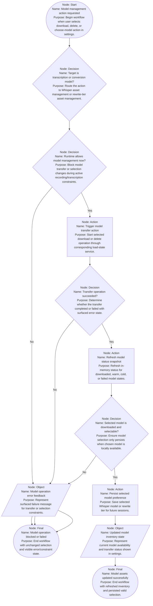

# Model Asset Management in Settings

```mermaid
flowchart TD
  S1(["Node: Start<br/>Name: Model management action requested<br/>Purpose: Begin workflow when user selects download, delete, or choose-model action in settings." ])
  D1{"Node: Decision<br/>Name: Target is transcription or conversion model?<br/>Purpose: Route the action to Whisper asset management or rewrite-tier asset management."}
  D2{"Node: Decision<br/>Name: Runtime allows model management now?<br/>Purpose: Block model transfer or selection changes during active recording/transcription constraints."}
  A1["Node: Action<br/>Name: Trigger model transfer action<br/>Purpose: Start selected download or delete operation through corresponding load-state service." ]
  D3{"Node: Decision<br/>Name: Transfer operation succeeded?<br/>Purpose: Determine whether the transfer completed or failed with surfaced error state."}
  A2["Node: Action<br/>Name: Refresh model status snapshot<br/>Purpose: Refresh in-memory status for downloaded, warm, cold, or failed model states." ]
  D4{"Node: Decision<br/>Name: Selected model is downloaded and selectable?<br/>Purpose: Ensure model selection only persists when chosen model is locally available."}
  A3["Node: Action<br/>Name: Persist selected model preference<br/>Purpose: Save selected Whisper model or rewrite tier for future sessions." ]
  O1[/"Node: Object<br/>Name: Updated model inventory state<br/>Purpose: Represent current model availability and transfer status shown in settings."/]
  O2[/"Node: Object<br/>Name: Model operation error feedback<br/>Purpose: Represent surfaced failure message for transfer or selection constraints."/]
  F1(["Node: Final<br/>Name: Model assets updated successfully<br/>Purpose: End workflow with refreshed inventory and persisted valid selection." ])
  F2(["Node: Final<br/>Name: Model operation blocked or failed<br/>Purpose: End workflow with unchanged selection and visible error/constraint state." ])

  S1 --> D1 --> D2
  D2 -->|No| O2 --> F2
  D2 -->|Yes| A1 --> D3
  D3 -->|No| O2 --> F2
  D3 -->|Yes| A2 --> D4
  D4 -->|No| O2 --> F2
  D4 -->|Yes| A3 --> O1 --> F1
```
