```mermaid
flowchart LR
  S1(["Node: Start<br/>Name: Transcript ready for assistant routing<br/>Purpose: Begin once speech has been transcribed and normalized."])
  A1["Node: Action<br/>Name: Detect assistant activation<br/>Purpose: Check the processed transcript for a matched assistant alias so the session can choose conversion or passthrough."]
  D1{"Node: Decision<br/>Name: Assistant conversion requested?<br/>Purpose: Branch between raw transcript delivery and the assistant rewrite pipeline."}
  A2["Node: Action<br/>Name: Deliver raw transcript<br/>Purpose: Copy or paste the processed transcript directly and record it as the latest transcription when no assistant conversion is requested."]
  F1(["Node: Final<br/>Name: Passthrough completed<br/>Purpose: End this feature with the raw transcript delivered without invoking the assistant model."])
  A3["Node: Action<br/>Name: Assemble candidate context inputs<br/>Purpose: Prefer the final selected-text capture, reuse the session clipboard snapshot, keep last transcription only while fresh, and keep prior assistant output only while fresh."]
  A4["Node: Action<br/>Name: Filter invalid candidates<br/>Purpose: Drop empty or oversized selected text, empty or oversized clipboard text, stale last transcription, and stale prior assistant output before routing."]
  D2{"Node: Decision<br/>Name: Any routeable context available?<br/>Purpose: Decide whether routing can choose a single external source or should stay as a dictated-only assistant request."}
  A5["Node: Action<br/>Name: Resolve single routing target<br/>Purpose: Use explicit source phrases first, then retry rules, then a tiny fallback model that can choose only one valid source or NONE."]
  A6["Node: Action<br/>Name: Build effective assistant prompt<br/>Purpose: Inject exactly one source or none, and prepend prior conversation only when the target is prior assistant output."]
  D3{"Node: Decision<br/>Name: Prompt within active word limit?<br/>Purpose: Enforce the current local or cloud model prompt ceiling before generation proceeds."}
  F2(["Node: Final<br/>Name: Prompt-limit failure surfaced<br/>Purpose: End conversion with a word-limit failure while preserving the raw transcript for recovery when the final prompt is too large."])
  O1[/"Node: Object<br/>Name: Effective assistant request<br/>Purpose: Represent the final system prompt with the active assistant name plus one routed context source or dictated speech only."/]
  A7["Node: Action<br/>Name: Generate converted output<br/>Purpose: Send the effective request to the active rewrite service and produce the assistant result for clipboard copy or protected auto-paste."]
  F3(["Node: Final<br/>Name: Converted output delivered<br/>Purpose: End with the assistant result delivered and remembered as the latest converted interaction for future retries or prior-output routing."])

  S1 --> A1 --> D1
  D1 -->|No| A2 --> F1
  D1 -->|Yes| A3 --> A4 --> D2
  D2 -->|Yes| A5 --> A6 --> D3
  D2 -->|No| A6 --> D3
  D3 -->|Yes| O1 --> A7 --> F3
  D3 -->|No| F2
```

Assumptions:
- Assumed "AI part ramp" means the conversion branch that ends at the active rewrite service call, because that is where the routed prompt body is finally sent for generation.
- Assumed the simplified design always injects at most one routed source, never target plus supporting sources.
